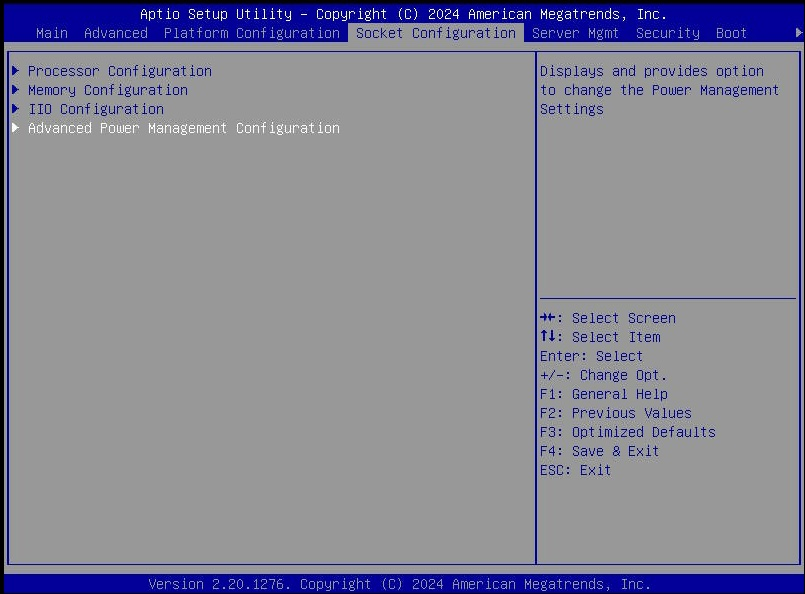
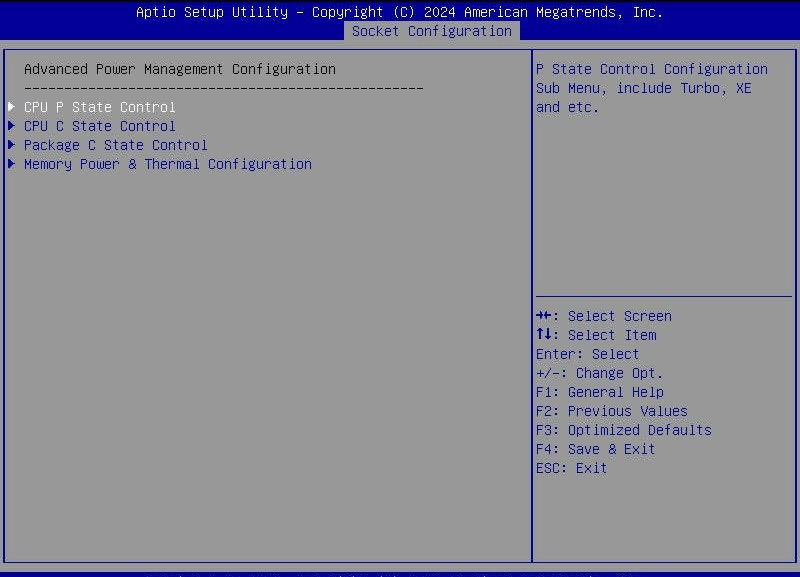
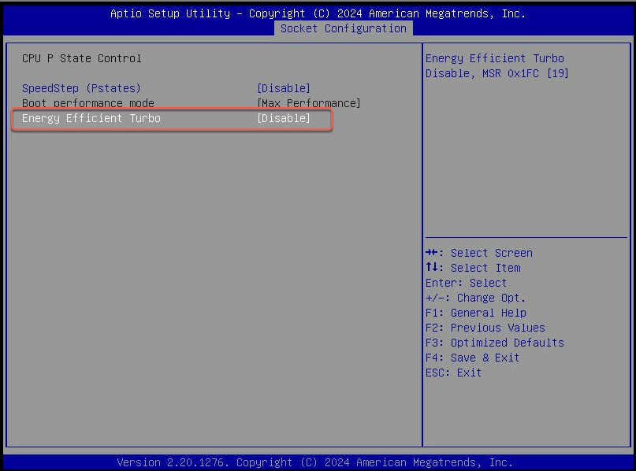
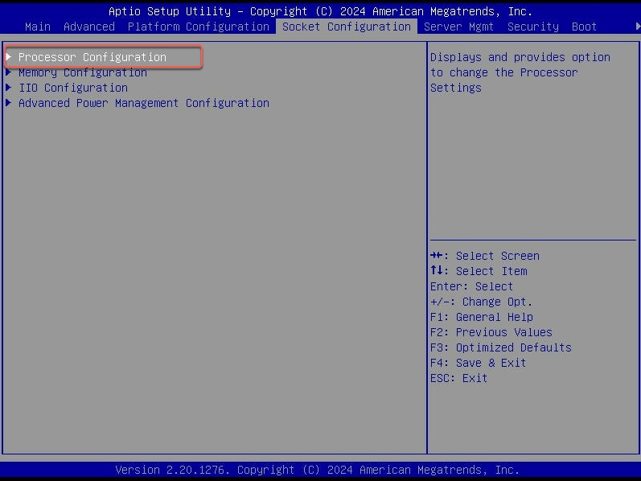
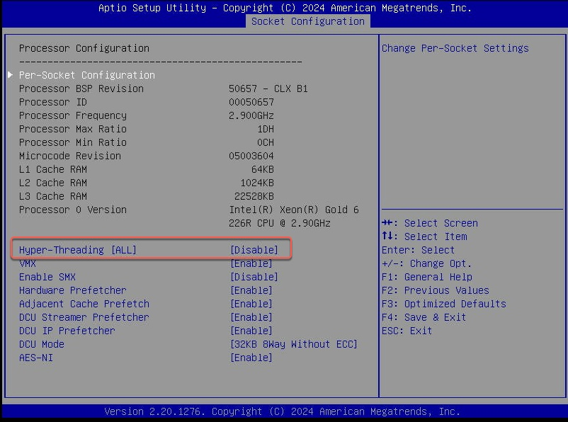
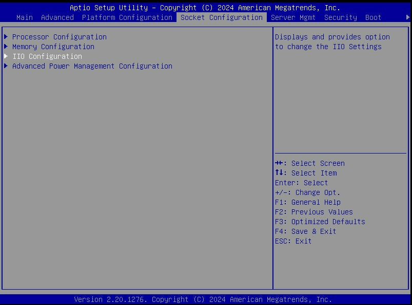
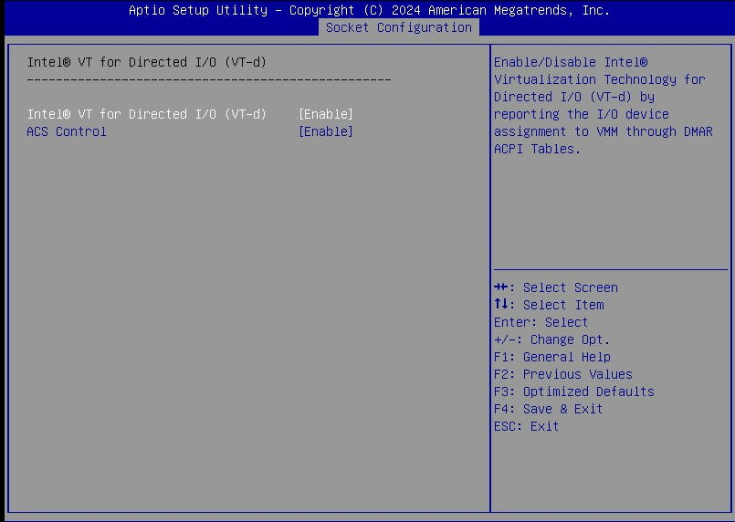
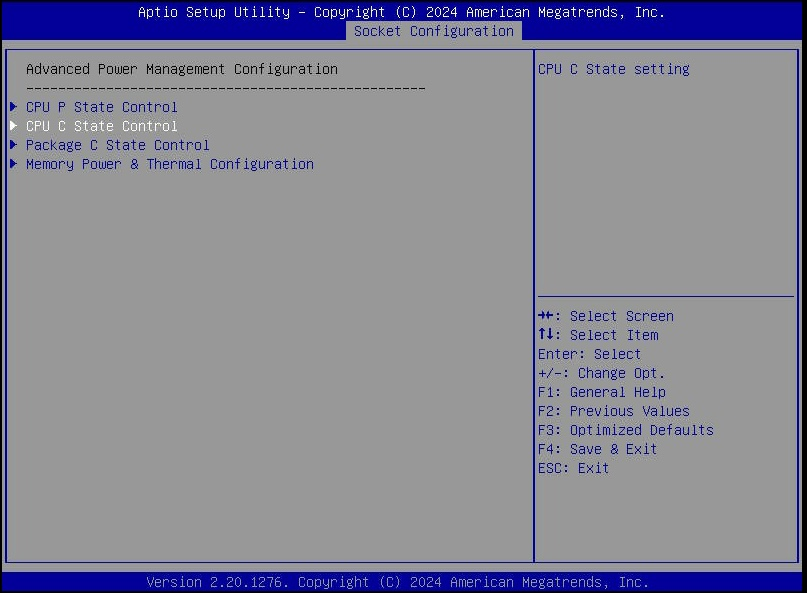
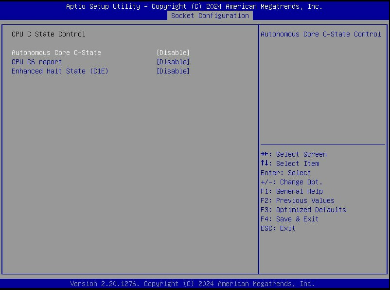

# Enlit 2025 build
This repo contains all artifacts used for build of enlit 2025 demos

## Building the ISO file for unattended installation of RHEL 9.6 on virtualization host

Request an AWS Open environment from demo.redhat.com and create an EC2 instance using the RHEL 9 AMI provided by Red Hat from the AWS console. We are going to use this host as image builder to build a custom ISO we can use to do unattended install of RHEL 9. Verify that host is up and running and that you can SSH into it.

Connect the system to Red Hat by running command below

```sh
sudo rhc connect -u <redacted> -p <redacted>
```

Ensure all current updates are applied to RPM packages by running command below

```sh
sudo dnf upgrade
```

Install infra.osbuild collection from ansible galaxy by running command below

```sh
ansible-galaxy collection install infra.osbuild
```

Create an inventory file and add the snippet below, replace as needed.
```sh
---
all:
  hosts:
    imagebuilder:
      ansible_host: "<specify>"
      ansible_port: 22
      ansible_user: "ec2-user"
      ansible_ssh_private_key_file: "<specify>"

```

Run ansible playbook to setup the imagebuilder server as shown in the command below

```sh
ansible-playbook -i inventory setup-imagebuilder.yml
```

Create an ansible vault and add yaml snippet below

```yaml
root_password: <specify>
admin_user: <specify>
admin_user_password: <specify>
admin_user_ssh_key: <specify>
```

Set vault secret you entered into environment variable like below

```sh
export VAULT_SECRET=<redacted>
```

To build ISO for automated install on Advantech ECU579 run build_iso.yml playbook as shown below 

```sh
ansible-playbook -i inventory --vault-password-file <(echo "$VAULT_SECRET") build_iso.yml -e @vars/advantech.yml
```

In the Ansible automation for building a custom image, we first create an Image Builder blueprint using the image definition file specifically tailored for installation on Advantech ECU579 hardware. The blueprint is created and uploaded to Image Builder using modules provided by the infra.osbuild
 Ansible collection.

Next, we trigger the image build process by running the composer-cli start compose command, which generates a custom ISO from the blueprint. The automation waits for the compose job to finish successfully, then creates a custom Kickstart file based on the Kickstart options defined in the Ansible variables file
. Before the Kickstart file is injected into the ISO, it is validated using the same helpful modules from the infra.osbuild collection.

The automation also generates cloud-init
 configuration files to initialize the system during provisioning. In this setup, cloud-init is used to create an admin user with an SSH key and to add a custom message to the /etc/motd file. Both the Kickstart and cloud-init files are then injected into the previously created ISO using the mkksiso tool.

Ideally, we aim to create a separate ISO that contains only the cloud-init seed files. During installation, this ISO can be mounted, and the Kickstart post-install script can copy the files from the mount directory into the provisioned system. This approach allows the same custom ISO to be reused across multiple systems with different credentials—by simply generating a new cloud-init seed ISO through automation and using it during installation.

Above ansible playbook will create a custom RHEL 9.6 ISO with a custom kickstart that performs a fully automated and unattended install. Download this ISO from the imagebuilder host using SCP as shown below

```sh
scp -i <your ssh pub key> <IP of imagebuilder>:<iso path> .
```

## Configuring the Host to run SSC600 SW (Centralized Protection and Control, CPC) virtualized
In this section we will cover how to configure the virtualization host for running SSC600 SW and deploy and instance of SSC600 SW virtual
machine on KVM

Ansible Collections to be installed

```sh
ansible-galaxy collection install git+https://github.com/rprakashg/vpac.git,main
```

### BIOS configurations that need to be set
Disable hyper-threading (simultaneous multi-threading/logical processors) and turbo boost. Also enable virtualization support (VMX/VT-X for Intel platforms) in the UEFI (or BIOS) settings. 
Make sure that the power saving features of the host are disabled. See the hardware vendor documentation for detailed information.

Steps described below are for Advantech ECU579. If you are using a different hardware please consult the hardware vendors documentation as mentioned above. Additionally these are currently set manually with no automation. Hopefully we can automate all these steps using supported ansible collections from the hardware partners.

### Disable Turbo boost
Follow steps below to disable turbo boost. Power on the host and hit `Esc` to enter bios. Once in bios navigate to
`Socket Configuration` -> `Advanced Power Management` Configuration as shown in screen capture below



This should bring up Advanced power management configuration options. Select `CPU P State control` as shown in screen capture below



This should bring up options you can configure for `CPU P State control` as shown in screen capture below. Select `Energy Efficient Turbo` option and hit enter to to disable



### Disable Hyper-Threading
Follow steps below to disable hyper threading. Navigate to `Socket Configuration` -> `Processor Configuration` from the bios menu as shown in screen capture below



This should bring up `Processor Configuration` options you can set in bios as shown in screen capture below. Select `Hyper-Threading [ALL]` and hit enter to disable it.



### Enable virtualization support 
Follow steps below to enable virtualization support. Navigate to `Socket Configuration` -> `IIO Configuration` as shown in the screen capture below



This should bring up `IIO Configuration` options you can set in bios as shown in screen capture below. Select `Intel VT for Directed I/O (VT=d)` and hit enter


This should bring up options you can set and select `Intel VT for Directed I/O (VT=d)` option and hit enter to enable it as shown in screen capture below



### Disable power saving features
Follow steps below to disable power saving features. In bios navigate to `Socket Configuration` -> `Advanced Power Management Configuration` as shown in screen capture below


This should bring up `Advanced Power Management Configuration` options you can set, select `CPU C State Control` and hit enter as shown in screen capture below



This should bring up all the `CPU C State` options you can set. Disable all as shown in screen capture below



This completes all the bios configurations we need to make and we can save and exit from bios.

## Install RHEL 9.6 on ECU579 using the custom ISO built earlier remotely using IPMI interface of the virtualization host
To install RHEL 9.6 on ECU579, access the IPMI web interface to remotely install using the ISO we built earlier. If you have not installed RHEL on ECU579 using the IPMI web interface I suggest you read [this](https://rprakashg.github.io/installing-rhel-using-ipmi/) blog post


## Update your inventory file with the information about the new RHEL host 
Update the inventory file and include information about the new virtualization host we provisioned on Advantech ECU579

Add snippet below under `hosts` section and replace as necessary

```yaml
virtualization_hosts:
  ansible_host: "<replace>"
  ansible_port: 22
  ansible_user: "admin"
  ansible_ssh_private_key_file: "<replace>"
```

## Configuring the host for deploying and running realtime workloads
Steps to prepare and configure the host for running realtime workload like ABB SSC600SW is automation using ansible. Execute the ansible playbook

```sh
ansible-playbook -i inventory configure_system.yml -e @vars/enlit.yml
```

## Deploying an instance of SSC600 SW virtual machine on RHEL KVM


```sh
ansible-playbook -i inventory deploy_ssc600_vm.yml -e @vars/vcpc1a.yml
```

## Install and Configure Windows HMI


